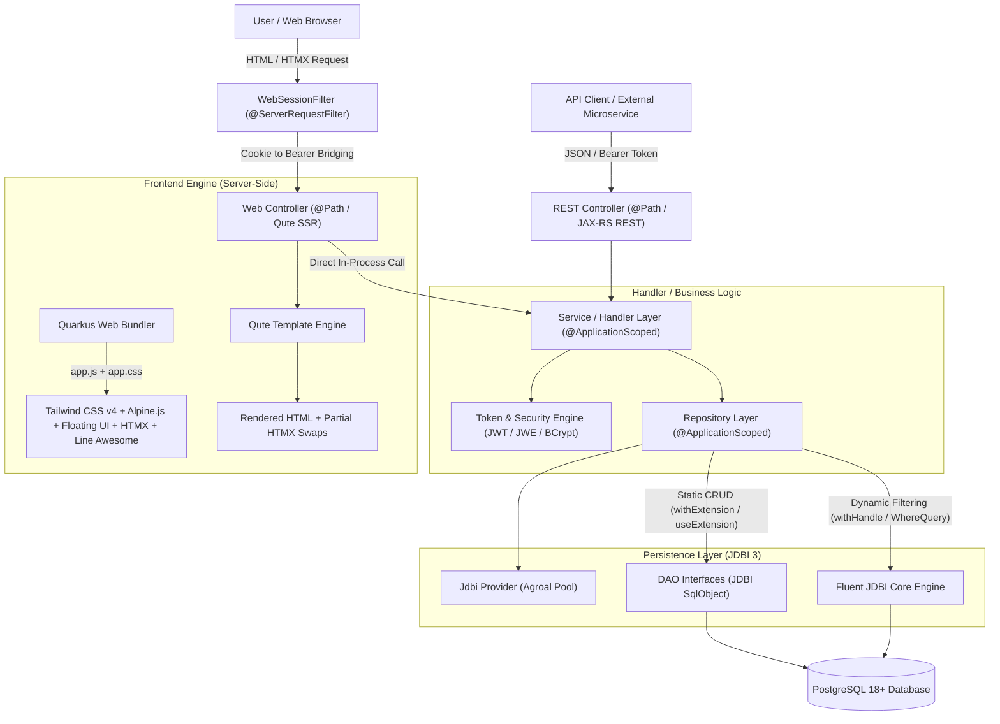
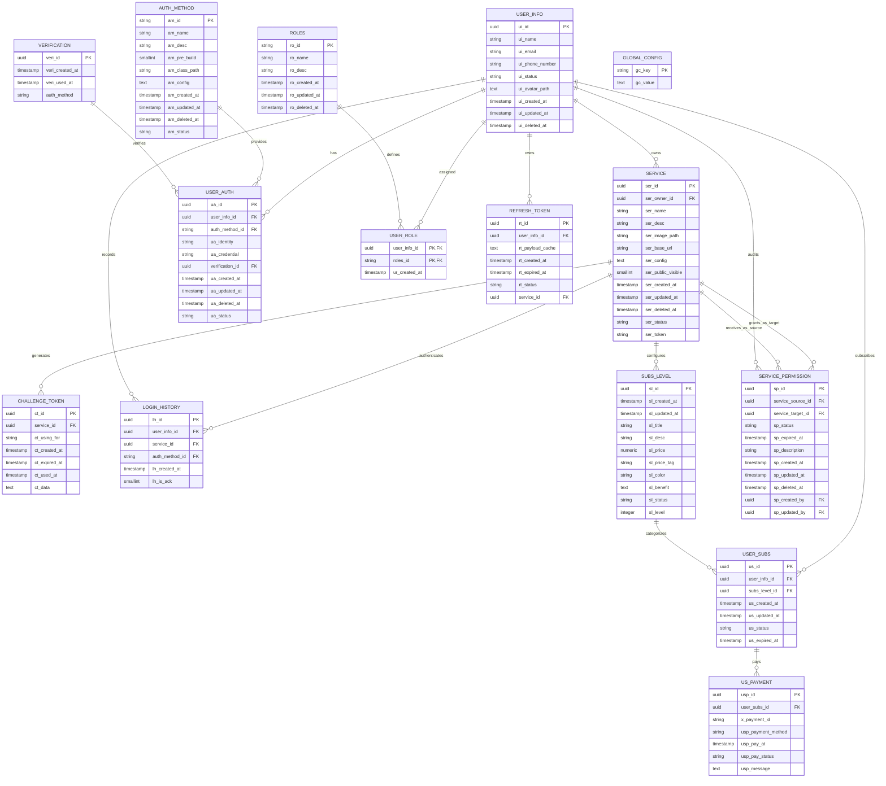
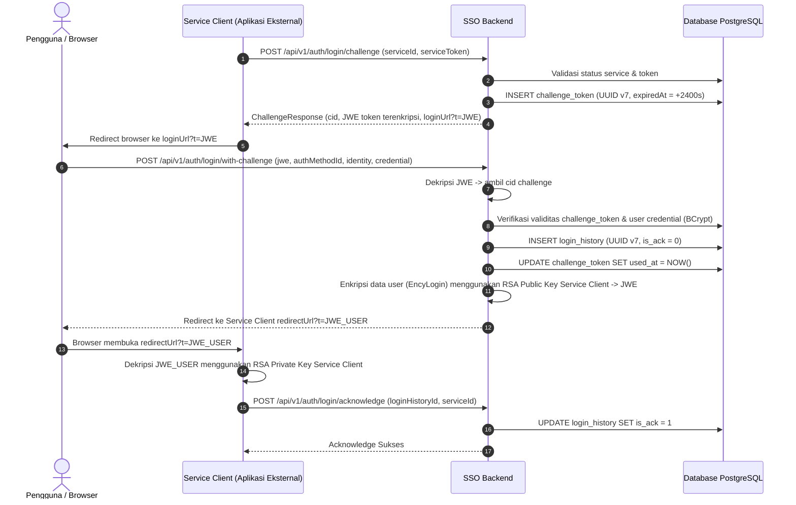
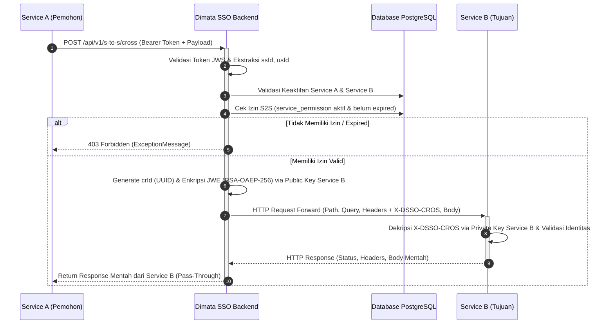

# Arsitektur Sistem: Dimata Single Sign-On (SSO) Backend

Dokumen ini mendefinisikan standar arsitektur perangkat lunak, model data, persistensi basis data, alur otentikasi kriptografis, dan konvensi implementasi untuk layanan Dimata SSO Backend.

---

## 1. Ringkasan Eksekutif & Karakteristik Sistem

Dimata SSO Backend adalah sistem Identity Provider (IdP) dan Single Sign-On terdistribusi yang dirancang untuk performa tinggi (*high-throughput*), latensi rendah, serta keamanan kriptografis tingkat enterprise.

### Karakteristik Kunci:
* **Stateless & High Concurrency:** Menggunakan Quarkus REST (RESTEasy Reactive non-blocking) di atas Java 25.
* **Direct Database Persistence:** Menghilangkan overhead ORM (tanpa Hibernate/Panache); seluruh akses data diproses langsung menggunakan **JDBI 3 + Postgres Driver** dengan SQL native teroptimasi.
* **Sequential Identifier (UUID v7):** Primary key domain transaksi menggunakan time-ordered UUID v7 untuk menjamin performa indeks B-Tree PostgreSQL tanpa fragmentasi halaman (*page splitting*).
* **Hybrid Cryptography Token Exchange:** Menggunakan kombinasi enkripsi asimetris RSA-OAEP-256 (JWE) dan penandatanganan token digital RS256 (JWS) untuk komunikasi aman antar service client.

---

## 2. Diagram Arsitektur Berlapis (*Layered Architecture*)



### Tanggung Jawab Tiap Lapisan:
1. **Web UI & Security Layer (`com.dimata.service.sso.web.*`):**
   - `WebSessionFilter`: Interseptor pra-pencocokan (`preMatching = true`) yang memvalidasi cookie HTTP-only (`access_token`, `refresh_token`), melakukan auto-refresh transparan via `JwtLoginHandler`, dan menjembatani token ke header `Authorization: Bearer <token>`.
   - `Web Controller`: Mengembalikan respons `TemplateInstance` (Qute) dengan data model langsung dari Service/Repository. Menangani navigasi halaman utuh serta respons fragmen parsial untuk swap dinamis HTMX.
2. **Endpoint / REST Controller (`com.dimata.service.sso.controller.*`):**
   - Menerima request HTTP JSON dari client luar, validasi deklaratif via `@Valid`.
   - Mengembalikan HTTP status code & payload JSON standar (200 OK, 204 No Content, 401 Unauthorized, dll).
   - **Aturan:** Dilarang meletakkan logika bisnis atau query SQL di controller.
3. **Service / Handler (`com.dimata.service.sso.handler.*`):**
   - Menjalankan seluruh aturan bisnis (*business rules*), orkestrasi multi-tabel, dan logika verifikasi.
   - Mengendalikan batas transaksi (*transaction boundary*).
   - Melakukan enkripsi kredensial (BCrypt) dan penandatanganan token (JWT/JWE).
4. **Repository (`com.dimata.service.sso.repo.jdbi.*.*Repos`):**
   - Lapisan enkapsulasi akses data berlingkup `@ApplicationScoped`.
   - Mengelola eksekusi query melalui interface SqlObject DAO dengan lifecycle terkontrol (`withExtension` / `useExtension`).
   - Menyediakan query dinamis dengan klausa kondisional opsional (`WhereQuery`).
5. **DAO SqlObject (`com.dimata.service.sso.repo.jdbi.*.*Dao`):**
   - Interface Java murni dianotasi `@RegisterConstructorMapper`, `@SqlQuery`, dan `@SqlUpdate`.
   - **Larangan Keras:** Dilarang memanggil `jdbi.onDemand(...)`.
6. **Entity Record (`com.dimata.service.sso.repo.jdbi.*.*Ent`):**
   - Java Record *immutable* dengan anotasi `@ColumnName`.
   - Menyediakan konstanta nama tabel dan kolom untuk mencegah kesalahan ketik (*typo*).

---

## 3. Desain Model Data & PostgreSQL Schema

### 3.1 Entity Relationship Diagram (ERD)



### 3.2 Strategi Tipe Data Kunci & Kolom

| Domain / Tabel | Tipe Primary Key | Generator ID | Alasan & Karakteristik |
|---|---|---|---|
| `user_info` | `UUID` | UUID v7 sequential (`RepoUtil.generateId()`) | Transaksional; skala jutaan pengguna; efisiensi B-Tree index. |
| `service` | `UUID` | UUID v7 sequential (`RepoUtil.generateId()`) | Service tenant terdaftar (Internal SSO ID: `01910000-0000-7000-8000-000000000001`). |
| `user_auth` | `UUID` | UUID v7 sequential (`RepoUtil.generateId()`) | Menampung banyak metode login per user (username, email, OAuth). |
| `roles` | `VARCHAR(50)` | Natural String (`ADMIN`, `SUPER`, `GUEST`, `SERVICE`) | Tabel katalog statis; mempermudah role checking deklaratif. |
| `auth_method` | `VARCHAR(50)` | Natural String (`PDUSERNAME`, `PDEMAIL`) | Tabel katalog implementer metode otentikasi. |
| `verification` | `UUID` | UUID v7 sequential (`RepoUtil.generateId()`) | Token verifikasi email/telepon satu kali pakai. |
| `challenge_token`| `UUID` | UUID v7 sequential (`RepoUtil.generateId()`) | Challenge login/register berbatas waktu kedaluwarsa. |
| `login_history` | `UUID` | UUID v7 sequential (`RepoUtil.generateId()`) | Audit log jejak login per service client. |
| `subs_level` | `UUID` | UUID v7 sequential (`RepoUtil.generateId()`) | Master paket langganan sistem. |
| `user_subs` | `UUID` | UUID v7 sequential (`RepoUtil.generateId()`) | Transaksi kepemilikan paket langganan aktif. |
| `us_payment` | `UUID` | UUID v7 sequential (`RepoUtil.generateId()`) | Rekam pembayaran invoice langganan. |
| `refresh_token` | `UUID` | UUID v7 sequential (`RepoUtil.generateId()`) | Session token refresh rotatif. |
| `service_permission` | `UUID` | UUID v7 sequential (`RepoUtil.generateId()`) | Izin akses lintas service (S2S) dengan batas waktu & audit. |
| `global_config` | `VARCHAR(100)`| Natural Key (`auth`, `email`, `redirect`, `roles`) | Konfigurasi sistem dinamis dalam format JSON. |


---

## 4. Alur Otentikasi & Keamanan Kriptografis

### 4.1 Alur Single Sign-On (SSO Challenge Flow)



### 4.2 Standar Kriptografi Token & Password
* **Password Hashing:** BCrypt dengan work factor 10 (`$2a$10$...`) via `BcryptHash.java`.
* **Access Token (JWS):** Ditandatangani menggunakan algoritma RS256 dengan private key SSO, validitas dikonfigurasi melalui `sso.jwt.exp`.
* **Challenge & SSO Payload (JWE):** Dienkripsi menggunakan algoritma `RSA-OAEP-256` dengan Content Encryption `A256GCM` menggunakan public key milik service client yang terdaftar.

---

## 5. Arsitektur Persistensi JDBI 3

### 5.1 Larangan Penggunaan `onDemand`
Di dalam aplikasi ini, pemanggilan `jdbi.onDemand(...)` **dilarang keras**.
* **Alasan Teknis:** `onDemand` membuat proxy dinamis yang membuka koneksi baru dari AgroalDataSource untuk setiap pemanggilan method, lalu langsung menutupnya. Pada beban tinggi (*high load*), ini menyebabkan *connection pool thrashing*, latensi eksekusi melonjak, dan risiko *connection exhaustion*.
* **Pola yang Diterapkan:**
  1. **Read-only query:**
     ```java
     public Optional<ServiceEnt> findById(UUID id) {
         return jdbi.withExtension(ServiceDao.class, dao -> dao.findById(id));
     }
     ```
  2. **Write / Mutation query:**
     ```java
     public void insert(ServiceEnt ent) {
         jdbi.useExtension(ServiceDao.class, dao -> dao.insert(ent));
     }
     ```
  3. **Atomic Transaction:**
     ```java
     jdbi.useTransaction(handle -> {
         var userAuthDao = handle.attach(UserAuthDao.class);
         var userRoleDao = handle.attach(UserRoleDao.class);
         userAuthDao.insert(authEnt);
         userRoleDao.insert(roleEnt);
     });
     ```

### 5.2 Dukungan Timestamp PostgreSQL (TimestampMapper)
Untuk memastikan kompatibilitas penuh antara kolom waktu PostgreSQL (`TIMESTAMP WITHOUT TIME ZONE` atau `TIMESTAMPTZ`) dengan `java.time.LocalDateTime` di Java records, `JdbiProvider` mendaftarkan custom mapper terintegrasi:
```java
jdbi.registerColumnMapper(LocalDateTime.class, (rs, col, ctx) -> {
    java.sql.Timestamp ts = rs.getTimestamp(col);
    return ts != null ? ts.toLocalDateTime() : null;
});
```
Hal ini mencegah timbulnya `PSQLException: Cannot convert the column of type TIMESTAMPTZ to requested type java.time.LocalDateTime`.

---

## 6. Arsitektur Web Frontend Terpadu (Quarkus Qute + HTMX + Tailwind)

Sistem Dimata SSO menyatukan frontend pengguna dan administrator langsung di dalam Quarkus (*integrated server-side rendering monolith*), meniadakan kebutuhan deployment terpisah dan latensi jaringan antar-layanan.

### 6.1 Struktur Routing Antarmuka
| Rute Web | Hak Akses | Deskripsi & Fungsionalitas |
|---|---|---|
| `/` | Publik | Landing page SSO, ringkasan fitur, showcase aplikasi ekosistem Dimata, dan status integrasi. |
| `/auth/login` | Publik | Pilihan portal login hanya untuk metode autentikasi aktif (Email, Username). Portal super admin disembunyikan demi keamanan. |
| `/auth/login/email` | Publik | Formulir login berbasis email dan verifikasi OTP/tautan (hanya jika metode email aktif). |
| `/auth/login/username` | Publik | Formulir login username & kata sandi dengan validasi keamanan dinamis (hanya jika metode username aktif). |
| `/auth/login/super` | Publik | Portal otentikasi darurat super user (`sysadmin`). |
| `/auth/signup` | Publik | Registrasi akun pengguna mandiri dengan auto-role default. |
| `/auth/verification` | Publik | Halaman verifikasi akun email dengan token aktivasi. |
| `/auth/logout` | Publik | Menghapus cookie `access_token` dan `refresh_token`, redirect ke landing page. |
| `/member` | Pengguna Terotentikasi | Portal anggota: greeting personal nama lengkap, aplikasi terhubung (milik user atau pernah di-login via SSO ack), status langganan, dan pendaftaran layanan baru. |
| `/member/apps/{id}/info` | Pengguna Terotentikasi (Owner Only) | Pengelolaan informasi umum aplikasi, deskripsi, dan upload cover (khusus pemilik sah aplikasi). |
| `/member/apps/{id}/security` | Pengguna Terotentikasi (Owner Only) | Pengelolaan secret token, rotasi token, dan pembuatan pasangan kunci RSA (khusus pemilik sah aplikasi). |
| `/member/apps/{id}/settings` | Pengguna Terotentikasi (Owner Only) | Pengelolaan redirect URL callback dan RSA public key (khusus pemilik sah aplikasi). |
| `/member/profile` | Pengguna Terotentikasi | Pengelolaan profil pengguna, edit nama, nomor telepon, dan foto avatar. |
| `/member/services` | Pengguna Terotentikasi | Pengelolaan direktori layanan milik member dan perizinan S2S antarlayanan (terbuka untuk seluruh akun non-admin). |
| `/member/auth-link` | Pengguna Terotentikasi | Pengaturan tautan otentikasi login multi-metode (Google, Email, Username). |
| `/member/subscriptions` | Pengguna Terotentikasi | Riwayat langganan dan paket aktif pengguna. |
| `/member/subscriptions/plans` | Pengguna Terotentikasi | Katalog paket langganan aplikasi Dimata yang tersedia. |
| `/member/subscriptions/checkout` | Pengguna Terotentikasi | Alur checkout pemesanan paket langganan baru. |
| `/member/connected-apps` | Pengguna Terotentikasi | Daftar aplikasi yang pernah di-login oleh user, waktu pertama & terakhir akses, frekuensi login, serta riwayat aktivitas sesi login akun sendiri. |
| `/admin` | Administrator (`ADMIN` / `SUPER`) | Dasbor metrik sistem: total pengguna, aplikasi aktif, paket langganan, dan metode auth. |
| `/admin/apps` | Administrator | Moderasi status service client (daftar aplikasi, filter status, aktivasi & nonaktivasi; detail konfigurasi ditutup demi privasi pelanggan). |
| `/admin/login-history` | Administrator | Dasbor monitoring riwayat login sistem: keterhubungan seluruh pengguna dengan aplikasi, log aktivitas login, dan filter pencarian. |
| `/admin/users` | Administrator | Manajemen direktori pengguna, registrasi dual-login (email & username), filter status, dan menu aksi. |
| `/admin/users/{id}` | Administrator | Detail profil pengguna, status, daftar role, metode autentikasi, daftar aplikasi yang pernah diakses, dan riwayat login terkini. |
| `/admin/users/{id}/edit` | Administrator | Formulir penyuntingan profil pengguna dan tindakan soft-delete. |
| `/admin/subscriptions` | Administrator | Manajemen katalog paket langganan (`subs_level` CRUD, status aktif/nonaktif). |
| `/admin/auth-methods` | Administrator | Direktori metode otentikasi login (pre-build vs custom), status aktif/nonaktif, dan menu aksi. |
| `/admin/auth-methods/{id}` | Administrator | Detail konfigurasi spesifik metode autentikasi (email verification template / password security rules). |
| `/admin/auth-methods/{id}/edit` | Administrator | Formulir penyuntingan konfigurasi dinamis yang disesuaikan dengan jenis auth method. |
| `/admin/global-config` | Administrator | Konfigurasi global SSO runtime (email template, URL redirect, default roles). |

### 6.2 Manajemen Sesi & Keamanan Web (`WebSessionFilter`)
1. **Cookie HTTP-Only:** Sesi login disimpan di browser menggunakan cookie `access_token` dan `refresh_token` dengan flag `HttpOnly`, `SameSite=Lax`, dan `Path=/`.
2. **Auto-Refresh Transparan:** Jika `access_token` telah kedaluwarsa namun `refresh_token` masih valid, `WebSessionFilter` secara otomatis memanggil `JwtLoginHandler.refreshToken(...)` di belakang layar, menyetel cookie baru ke respons HTTP, dan meloloskan permintaan tanpa mengharuskan pengguna login ulang.
3. **Bridging Otomatis:** Token yang diekstrak dari cookie diinjeksikan langsung ke dalam request context header `Authorization: Bearer <token>`, sehingga filter keamanan `@RolesAllowed` dan `SecurityIdentity` Quarkus berjalan transparan tanpa modifikasi.
4. **Proteksi Rute Sensitif:** Jika pengguna tanpa sesi yang sah mengakses rute `/member/*` atau `/admin/*`, filter langsung mengarahkan (*redirect*) ke `/auth/login`.

### 6.3 Interaktivitas Klien (HTMX + Alpine.js + Floating UI + Hyperscript)
* **HTMX 2.0:** Menangani pencarian tabel *real-time* (`hx-trigger="keyup changed delay:300ms"`), penyaringan data, pagination, dan *partial swapping* HTML tanpa reload halaman penuh (`hx-target`, `hx-swap="outerHTML"`).
* **Alpine.js 3.14:** Menangani state UI lokal yang murni berbasis browser (modal dialog buka/tutup, tab navigasi dasbor, preview gambar unggahan avatar/cover, dan copy token ke clipboard).
* **Floating UI DOM 1.7.6 (`@floating-ui/dom` via `org.mvnpm.at.floating-ui:dom`):**
  - Mengelola kalkulasi matematis posisi seluruh elemen mengambang (*floating elements*) secara murni dengan JavaScript (tanpa React).
  - **Dynamic Dropdown & Combobox (`Alpine.data('dropdownSelect')` & `components/dropdown.html`):** Menu mengambang diposisikan relatif terhadap elemen input/button trigger via `computePosition` dan `autoUpdate`. Middleware `size` mengunci lebar menu agar persis selebar input trigger dan membatasi tinggi maksimum menu sesuai ruang viewport yang tersedia. Middleware `flip()` dan `shift({ padding: 8 })` mencegah menu terpotong di tepi layar atau bagian bawah.
  - **Overflow-Safe Action Menus & Popovers (`Alpine.data('floatingMenu')` & `Alpine.data('floatingPopover')`):** Menggunakan `strategy: 'fixed'` untuk menu aksi tabel (`/admin/users`, `/admin/auth-methods`) dan menu profil layout member, sehingga menu tidak pernah terpotong (*clipped*) oleh kontainer tabel horizontal scroll (`overflow-x: auto`).
  - **Zero-Flicker Architecture:** Seluruh elemen floating dideklarasikan dengan kelas `fixed` atau `absolute` langsung pada markup HTML dan dijaga `visibility: hidden` selama inisialisasi awal. Pada dropdown (`components/dropdown.html`), kelas `absolute left-0 top-full mt-1.5 w-full max-h-60` menjamin lebar dan batas tinggi terkunci sejak frame ke-0, mencegah reflow atau scrollbar liar (*scrollbar thrashing*) pada modal dialog bertipe `overflow-y: auto`. Lifecycle `autoUpdate` dikonfigurasi dengan `{ elementResize: false }` untuk meniadakan loop ResizeObserver dan eksekusi ganda. Properti `visibility: visible` disetel bersamaan dengan koordinat `left`/`top` saat kalkulasi `computePosition` selesai, menjamin transisi 100% mulus tanpa kedip pada klik pertama maupun seterusnya.
  - **Universal Tooltip Manager:** Singleton tooltip diatur secara global di `app.js` yang merespons atribut deklaratif `data-tooltip="..."` (serta `data-placement`) atau direktif Alpine `x-tooltip="..."` dengan animasi fade in dan positioning presisi `offset(6)`, `flip()`, dan `shift({ padding: 6 })`.
* **Hyperscript 0.9:** Menyederhanakan event interaktif deklaratif sebaris (misalnya menutup alert notifikasi secara mulus dengan transisi fade out).
* **Line Awesome 1.3:** Pustaka ikon modern berbasis font vector (`las la-*`) untuk seluruh elemen antarmuka.

### 6.4 Standar Type-Safe Templates (`@CheckedTemplate`) & Quarkus REST Qute
1. **Integrasi Serialisasi (`quarkus-rest-qute`):** Modul `io.quarkus:quarkus-rest-qute` disertakan pada `pom.xml` untuk mendaftarkan penyedia `MessageBodyWriter<TemplateInstance>`. Hal ini memastikan bahwa kembalian `TemplateInstance` dari JAX-RS/Quarkus REST endpoint di-render sebagai dokumen HTML dan bukan dikonversi ke string object representatif.
2. **Pola Deklarasi `@CheckedTemplate`:** Seluruh template web dikelompokkan ke dalam static inner class dengan anotasi `@CheckedTemplate`:
   ```java
   @CheckedTemplate(basePath = "landing", defaultName = CheckedTemplate.HYPHENATED_ELEMENT_NAME)
   public static class Templates {
       public static native TemplateInstance index(List<ServiceProfileDto> apps, List<SubsLevelEnt> plans);
   }
   ```
3. **Validasi Compile-Time (Zero-Runtime Missing Key Errors):** Mesin Qute memvalidasi kesesuaian tipe data method signature dan ekspresi parameter template HTML secara otomatis saat build (`mvn compile`). Hal ini memastikan seluruh field record (seperti `.title`, `.status`, `.phoneNum`) terikat secara akurat dan mencegah `PropertyNotFoundException` di lingkungan produksi.

---

## 7. Modul Service to Service (S2S) Cross Request

Modul S2S memungkinkan sebuah aplikasi terdaftar (**Service A**) untuk meminta data ke aplikasi lain (**Service B**) melalui jembatan otentikasi aman Dimata SSO, hanya jika **Service B telah memberikan izin eksplisit** kepada Service A dan izin tersebut belum kedaluwarsa.

### 7.1 Alur Kriptografis & Forwarding Cross Request



### 7.2 Header Kriptografis `X-DSSO-CROS`
Setiap request yang diteruskan ke Service B disematkan header `X-DSSO-CROS` yang berupa JWE (JSON Web Encryption) berstandar RSA-OAEP-256 dengan payload:
```json
{
  "crId": "01910000-0000-7000-8000-000000000001", 
  "ssId": "01910000-0000-7000-8000-000000000002",
  "usId": "01910000-0000-7000-8000-000000000003"
}
```
Service B mendekripsi header ini menggunakan RSA Private Key miliknya sendiri untuk memverifikasi asal service pemohon (`ssId`) dan identitas user yang melakukan aksi (`usId`).

### 7.3 Kebijakan Keamanan Non-Root (*Tenant Data Sovereignty*)
Demi privasi dan keamanan data pelanggan, hak untuk memberikan, memperbarui, atau mencabut izin akses S2S hanya dimiliki secara eksklusif oleh pengguna yang menjadi pemilik sah service target (`service.ser_owner_id == currentUser.id`).
- Pengguna dengan role `ADMIN` atau `SUPER` (Root) **secara tegas dilarang (HTTP 403 Forbidden)** mengatur izin S2S service milik pengguna lain.

### 7.4 Kebijakan Kedaulatan Aplikasi (*Application Sovereignty*)
Demi privasi dan keamanan data pelanggan, konfigurasi aplikasi bersifat rahasia dan otonom:
- **Hak Akses Eksklusif Pemilik (*Owner Only*):** Hanya pengguna pemilik sah aplikasi (`service.ser_owner_id == currentUser.id`) yang berhak melihat detail, secret token, konfigurasi redirect URL, public key RSA, mengubah metadata aplikasi, dan merotasi token melalui portal `/member/apps/{id}/*` atau REST API `ServiceMemberController`.
- **Pembatasan Administrator (*Admin Non-Root for Apps*):** Administrator (`ADMIN` / `SUPER`) **dilarang keras** melihat detail rahasia, token, atau menyunting konfigurasi aplikasi milik pengguna lain. Seluruh akses detail aplikasi pada Web Admin dialihkan kembali ke `/admin/apps` dengan peringatan error akses ditolak, dan endpoint REST admin sensitif menghasilkan status HTTP `403 Forbidden`.
- **Wewenang Moderasi Terbatas:** Administrator hanya memiliki wewenang moderasi operasional untuk mengaktifkan (`ACTIVE`) atau menonaktifkan (`DEACTIVE`) status aplikasi melalui aksi form POST `/admin/apps/{id}/status` atau REST API PUT `/api/v1/service/status/{id}`.

---

## 8. Pelacakan Login Pengguna ke Aplikasi (*User Application Login Tracking*) & Kesiapan Notifikasi Webhook

Modul pelacakan login mencatat setiap peristiwa otentikasi pengguna ke aplikasi (*service client*) eksternal maupun ke portal internal SSO. Data ini membentuk relasi dinamis keterhubungan pengguna dengan aplikasi-aplikasi yang pernah diaksesnya.

### 8.1 Alur Pencatatan Multi-Jalur
1. **SSO Challenge Login (Aplikasi Pihak Ketiga):**
   - Saat pengguna masuk melalui form SSO challenge (`/auth/login/*?t=JWE` atau `POST /api/v1/login/challenge`), sistem merekam entitas `LoginHistoryEnt` dengan flag awal `acknowledge = 0` (menunggu konfirmasi).
   - Saat aplikasi client memproses callback dan memanggil `PUT /api/v1/integration/login/{ackId}/acknowledge`, sistem mengupdate flag `lh_is_ack = 1`.
2. **Direct Web Login (Portal SSO Internal):**
   - Saat pengguna masuk langsung ke portal member SSO via email atau username, sistem secara otomatis merekam entitas `LoginHistoryEnt` dengan `service_id = SERVICE_SSO_ID` (`01910000-0000-7000-8000-000000000001`) dan `acknowledge = 1`.
   - Hal ini memastikan seluruh jejak akses portal mandiri maupun sysadmin tercatat secara konsisten.

### 8.2 Struktur Agregasi & DTO
- `UserConnectedAppDto`: Menyajikan ringkasan aplikasi yang pernah di-login oleh user tertentu, mencakup waktu login pertama (`firstLoginAt`), waktu login terakhir (`lastLoginAt`), total frekuensi login (`loginCount`), dan metode login terakhir (`lastAuthMethod`).
- `LoginHistoryDetailDto`: Menyajikan catatan audit log sekuensial per event login dengan informasi nama user, nama aplikasi, metode auth, dan status verifikasi.
- `UserAppSummaryDto`: Menyajikan pemetaan seluruh pengguna terhadap aplikasi terhubung pada dasbor administrator.

### 8.3 Kesiapan Arsitektur Webhook Notifikasi (*Future Webhook Dispatch*)
Sistem dirancang siap untuk mendukung pengiriman webhook ke seluruh service yang terhubung saat status pengguna berubah (misal dinonaktifkan):
- Method `LoginHistoryRepos.findDistinctServicesByUserId(UUID userId)` mengekstrak daftar entitas `ServiceEnt` unik yang pernah diakses oleh pengguna terkait.
- Ketika event perubahan status pengguna (`UserInfoStats.DEACTIVATED` / `INACTIVE`) dieksekusi di masa mendatang, handler notifikasi dapat langsung mengorkestrasikan pengiriman payload API ke webhook URL masing-masing service terdaftar tanpa perlu merombak skema data.


