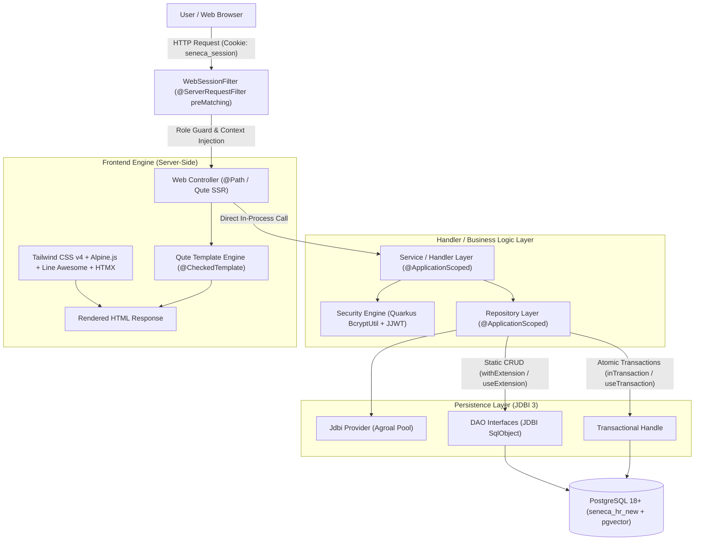
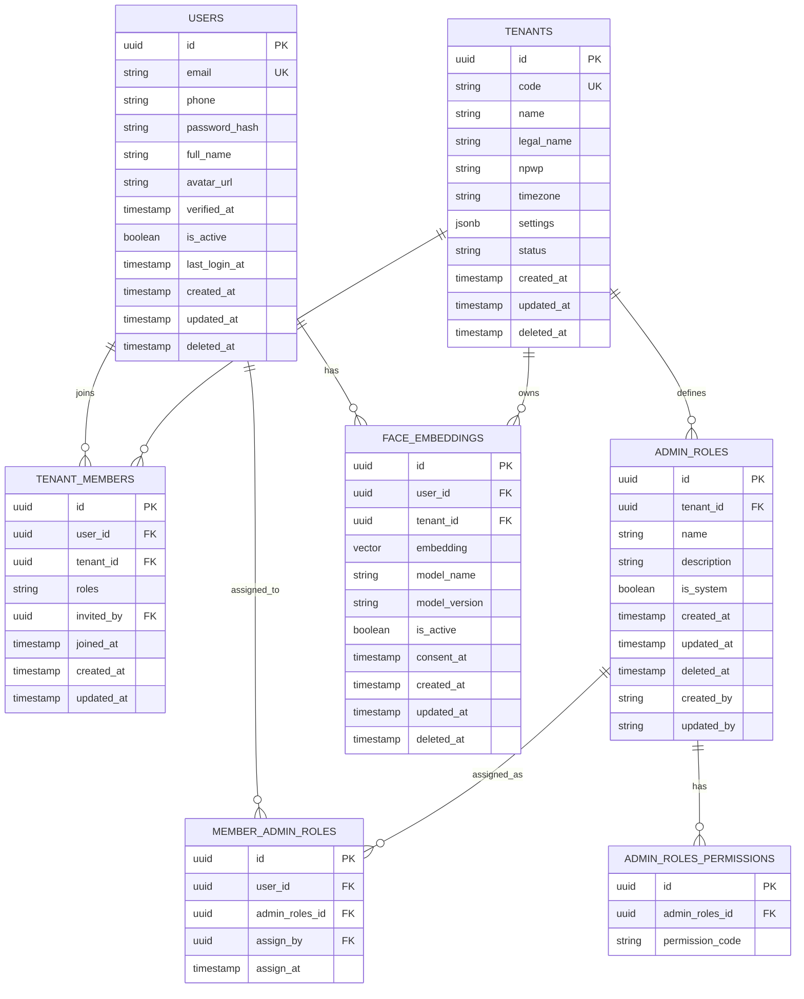

# Arsitektur Sistem: Seneca HR Engine

Dokumen ini mendefinisikan standar arsitektur perangkat lunak, model data multi-tenant, persistensi basis data JDBI 3, keamanan berbasis peran 4-tingkat (*super, owner, admin, employee*), penyimpanan biometrik wajah dengan PostgreSQL pgvector, serta antarmuka SSR terpadu Quarkus Qute untuk sistem **Seneca HR**.

---

## 1. Ringkasan Eksekutif & Karakteristik Sistem

Seneca HR adalah sistem pengelolaan sumber daya manusia (*Human Resources*) berbasis multi-tenant dengan performa tinggi (*high-throughput*), latensi rendah, serta keamanan kriptografis tingkat enterprise.

### Karakteristik Kunci:
* **Stateless & High Concurrency:** Menggunakan Quarkus REST (RESTEasy Reactive non-blocking) di atas Java 25.
* **Direct Database Persistence (Bebas ORM):** Menghilangkan overhead Hibernate / JPA / Panache. Seluruh akses data diproses langsung menggunakan **JDBI 3 Core + SqlObject + Postgres Plugin** dengan query SQL native teroptimasi.
* **Sequential Identifier (UUID v7):** Seluruh primary key transaksional dan domain menggunakan time-ordered UUID v7 (`RepoUtil.generateId()` via `com.github.f4b6a3:uuid-creator`) guna mencegah fragmentasi indeks B-Tree PostgreSQL (*page splitting*).
* **Multi-Tenant Model:** Setiap entitas root dalam tenant wajib memiliki `tenant_id`. Seorang pengguna dapat menjadi anggota di beberapa tenant sekaligus dengan peran yang berbeda.
* **Penyimpanan Biometrik Wajah (pgvector):** Mendukung pencatatan dan pencarian vektor embedding wajah (512 dimensi) langsung di PostgreSQL 18+ menggunakan ekstensi native `pgvector`.
* **Keamanan Berbasis Peran 4-Tingkat:** Mengadopsi hierarki ketat: `super -> owner -> admin -> employee`.
* **Integrated SSR Monolith (PatternFly Enterprise Light Interface):** Antarmuka web server-side rendering menggunakan Quarkus Qute Type-Safe Templates (`@CheckedTemplate`), Tailwind CSS v4, Alpine.js, Line Awesome, dan HTMX sesuai standar desain PatternFly Enterprise Light Mode pada `docs/DESIGN.md`.

---

## 2. Diagram Arsitektur Berlapis (*Layered Architecture*)



### Tanggung Jawab Tiap Lapisan:
1. **Web Security & Session Layer (`tech.harlabs.web.security.*`):**
   - `WebSessionFilter`: Interseptor pra-pencocokan (`preMatching = true`) yang memvalidasi cookie HTTP-only `seneca_session`, mendekripsi token sesi via JJWT, menginjeksi `SenecaUserSession`, dan melindungi rute `/super/**` serta `/owner/**`.
   - `PasswordUtil`: Hashing dan verifikasi kata sandi aman berbasis BCrypt work factor 10 via Quarkus Security `BcryptUtil`.
   - `SessionTokenService`: Mengelola signing dan validasi HMAC-SHA256 untuk payload sesi pengguna.
2. **Web Controller Layer (`tech.harlabs.web.controller.*`):**
   - Mengendalikan navigasi halaman, parsing parameter form (`@FormParam`), serta mengembalikan respons `TemplateInstance` (Qute) dengan data yang tervalidasi pada saat kompilasi (`@CheckedTemplate`).
   - Berjalan *in-process* tanpa overhead REST/HTTP internal.
3. **Service / Handler Layer (`tech.harlabs.handler.*`):**
   - `AuthHandler`: Otentikasi kredensial, resolusi tenant aktif, dan rotasi cookie sesi.
   - `SuperHandler`: Logika operasional global sistem (metrik infrastruktur, manajemen tenant, audit pengguna global).
   - `OwnerHandler`: Logika operasional tenant (profil perusahaan, manajemen pegawai, pembuatan admin roles & perizinan, pendaftaran embedding wajah).
4. **Repository Layer (`tech.harlabs.repo.jdbi.*.*Repos`):**
   - Abstraksi data akses `@ApplicationScoped`.
   - Mengelola eksekusi query melalui interface SqlObject DAO dengan lifecycle aman (`withExtension` / `useExtension`).
   - **Aturan Tegas:** Dilarang keras menggunakan `jdbi.onDemand(...)`.
5. **DAO SqlObject Layer (`tech.harlabs.repo.jdbi.*.*Dao`):**
   - Interface Java murni yang dianotasi `@RegisterConstructorMapper`, `@SqlQuery`, dan `@SqlUpdate`.
6. **Entity Record Layer (`tech.harlabs.repo.jdbi.*.*Ent`):**
   - Java Record *immutable* dengan konstanta nama tabel dan kolom (`public static final String TABLE_NAME`, `FIELDS`, `BINDERS`) untuk integritas kompilasi.

---

## 3. Desain Model Data & PostgreSQL Schema

### 3.1 Entity Relationship Diagram (ERD)



### 3.2 Strategi Tipe Data & Primary Key

| Domain / Tabel | Tipe Primary Key | Generator ID | Karakteristik & Alasan |
|---|---|---|---|
| `users` | `UUID` | UUID v7 sequential (`RepoUtil.generateId()`) | Transaksional; skala jutaan baris; efisiensi B-Tree index. |
| `tenants` | `UUID` | UUID v7 sequential (`RepoUtil.generateId()`) | Identitas unik organisasi/perusahaan. |
| `tenant_members` | `UUID` | UUID v7 sequential (`RepoUtil.generateId()`) | Menghubungkan user dengan banyak tenant (multi-tenancy). |
| `admin_roles` | `UUID` | UUID v7 sequential (`RepoUtil.generateId()`) | Role administratif kustom per tenant. |
| `admin_roles_permissions` | `UUID` | UUID v7 sequential (`RepoUtil.generateId()`) | Pemetaan izin terperinci per role. |
| `member_admin_roles` | `UUID` | UUID v7 sequential (`RepoUtil.generateId()`) | Penugasan role admin kepada anggota tertentu. |
| `face_embeddings` | `UUID` | UUID v7 sequential (`RepoUtil.generateId()`) | Vektor biometrik 512 dimensi (`vector(512)`). |

---

## 4. Model Hak Akses & Keamanan Sesi

### 4.1 Hierarki 4 Peran (*4-Tier Roles*)
1. **`super`:** Akses penuh ke seluruh sistem secara global. Hanya ada satu akun super dengan identitas tetap `sysadmin` (`sysadmin@seneca.local`).
2. **`owner`:** Pemilik tenant/perusahaan. Memiliki kendali mutlak atas seluruh data tenant yang dimilikinya, dapat mengundang pegawai, membuat admin roles kustom, dan menugaskan peran administratif.
3. **`admin`:** Pegawai yang diberi wewenang administratif oleh Owner, dengan ruang lingkup dibatasi oleh daftar izin (*permissions*) yang disematkan pada role-nya.
4. **`employee`:** Pegawai biasa dalam suatu tenant. Hanya dapat mengakses dan melihat data terkait dirinya sendiri.

### 4.2 Alur Otentikasi & Proteksi Rute
1. Pengguna mengirimkan form `POST /login` (Email & Password).
2. `AuthHandler` memverifikasi hash BCrypt dan status keaktifan akun.
3. Sistem mendeteksi relasi membership tenant milik user. Jika user memiliki lebih dari satu tenant, tenant pertama dipilih sebagai default dan user dapat berganti tenant sewaktu-waktu melalui `POST /switch-tenant`.
4. Token sesi ditandatangani menggunakan JJWT HMAC-SHA256 dan diset ke browser dalam bentuk cookie `seneca_session` berflag `HttpOnly`, `SameSite=Lax`, dan `Path=/`.
5. `WebSessionFilter` secara otomatis memeriksa setiap request:
   - Rute `/super/**` wajib memiliki sesi dengan flag `isSuper = true`.
   - Rute `/owner/**` wajib memiliki peran `owner` pada tenant yang sedang aktif (atau berstatus `super`).
   - Akses yang tidak sah ditolak dengan status HTTP 403 Forbidden atau diarahkan ke `/login`.

---

## 5. Arsitektur Persistensi JDBI 3

### 5.1 Larangan Penggunaan `jdbi.onDemand(...)`
`jdbi.onDemand(...)` dilarang keras di seluruh codebase Seneca HR untuk mencegah overhead pembuatan dynamic proxy dan pemborosan koneksi AgroalDataSource.
Setiap DAO dieksekusi menggunakan ekstensi:
```java
// Operasi Baca (Read)
public Optional<TenantsEnt> findById(UUID id) {
    return jdbi.withExtension(TenantsDao.class, dao -> dao.findById(id));
}

// Operasi Tulis (Write)
public void insert(TenantsEnt ent) {
    jdbi.useExtension(TenantsDao.class, dao -> dao.insert(ent));
}

// Transaksi Atomik Multi-Tabel
jdbi.useTransaction(handle -> {
    var memberDao = handle.attach(TenantMembersDao.class);
    var roleDao = handle.attach(MemberAdminRolesDao.class);
    memberDao.insert(memberEnt);
    roleDao.insert(roleEnt);
});
```

### 5.2 Kompatibilitas Timestamp PostgreSQL & pgvector
`JdbiProvider` mendaftarkan custom mapper terintegrasi:
- `java.time.LocalDateTime`: Mengonversi `java.sql.Timestamp` dari kolom `TIMESTAMP` PostgreSQL secara otomatis, mencegah kesalahan tipe `PSQLException`.
- `pgvector`: Query SQL DAO melakukan cast eksplisit `:embedding::vector` pada operasi simpan, dan `embedding::text` pada operasi baca.

---

## 6. Arsitektur Antarmuka (PatternFly Enterprise Light Mode + Quarkus Qute)

Desain antarmuka mengacu pada sistem desain enterprise **PatternFly** (https://www.patternfly.org/) dan panduan `docs/DESIGN.md`:
* **Universal Inter Font (100% Inter) & Proteksi Icon Fonts:** Seluruh teks dan tipografi antarmuka tanpa terkecuali menggunakan font resmi **Inter** (Google Fonts CDN `Inter:wght@300;400;500;600;700;800;900`) melalui styling terpadu (`body, input, button, select, textarea, optgroup`). Icon font **Line Awesome** diproteksi secara khusus (`.la, .las, .lar, .lab { font-family: 'Line Awesome Free' !important; }`) agar seluruh glyph ikon ter-render dengan sempurna tanpa menjadi kotak (Unicode tofu).
* **Tata Letak Main View Terpusat (`w-full max-w-7xl mx-auto`):** Konten modul halaman selalu diposisikan di tengah (*centered*) pada layar monitor desktop maupun ultrawide, tidak merapat ke sisi kiri.
* **Komponen Navigasi Samping Reusable & Anti-Flickering (`components/sidenav.html`):** Sidebar yang dapat diciutkan (*collapsible*) pada desktop (lebar 20 tailwind / 80px dengan tampilan icon-only) dan berfungsi sebagai off-canvas drawer dengan latar gelap tembus pandang (*backdrop blur*) pada perangkat mobile. Dilengkapi pencegah flickering (dimensi statis awal, scoped CSS transitions, View Transitions cross-document, dan status collapse tersimpan di `localStorage`).
* **Header Terpadu dengan Aksi di Pojok Kanan Atas (`components/header.html`):** Header sticky yang menampung tombol toggle navigasi, judul modul, serta informasi profil user dan tombol *Keluar Sesi* (`/logout`) yang diposisikan di pojok kanan atas.
* **Komponen Dropdown Modern (`components/dropdown.html` & `modernDropdown`):** Menggantikan seluruh elemen raw `<select>` dengan komponen interaktif berbasis Alpine.js yang mendukung mode sederhana maupun filterable/pencarian real-time, dismiss saat klik di luar, dan kemampuan submit form native.
* **Type-Safe Templates (`@CheckedTemplate`):** Seluruh controller mendeklarasikan static inner class `Templates` dengan signature method yang divalidasi oleh kompiler Qute saat build (`mvn compile`), menjamin pencegahan runtime template error.
* **Interaktivitas Ringan:** Modal dialog dan interaksi antarmuka dikendalikan menggunakan Alpine.js 3.14, pembaruan data parsial menggunakan HTMX 2.0, serta ikon vektor Line Awesome 1.3.

---

## 7. Port Layanan & Lingkungan Eksekusi

Aplikasi berjalan pada port HTTP **8698** (`quarkus.http.port=8698`) dengan basis data default `seneca_hr_new` di PostgreSQL 18.
Migrasi skema basis data dikelola secara otomatis melalui Flyway (`src/main/resources/db/migration/`) dengan aturan ketat: **satu file migrasi untuk satu tabel**.
